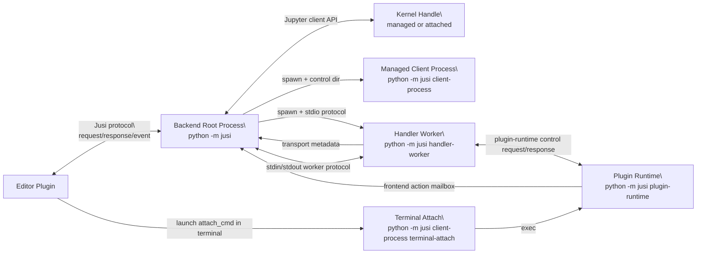
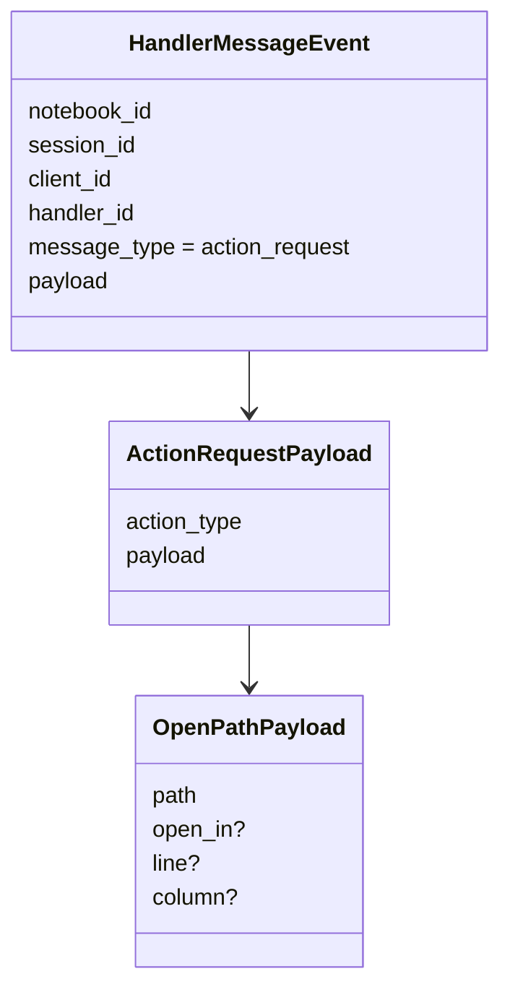
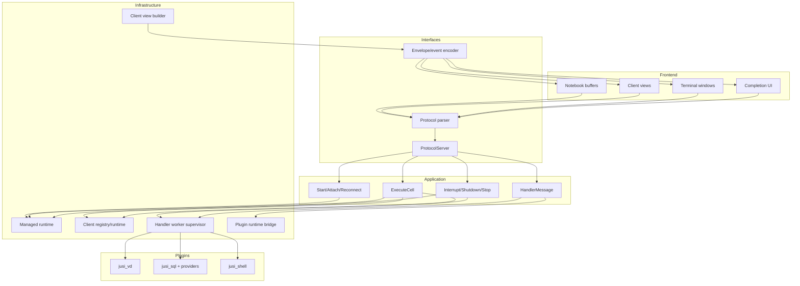
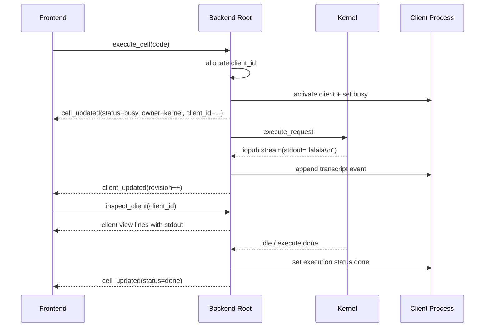
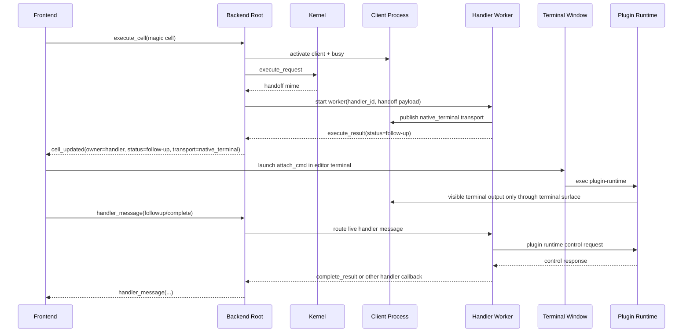
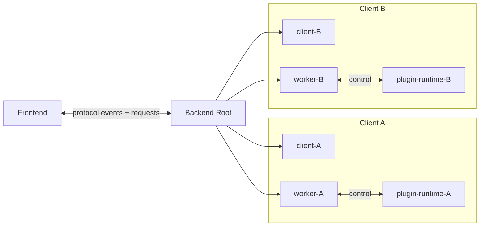

# Jusi Backend Map

This document is the practical backend map for the current Jusi shape.

It is meant to answer:

- which actors exist
- how they talk to each other
- which protocols and side channels are involved
- which module owns what
- what the important runtime flows look like

## Glossary

- `editor plugin`
  - the Vim/Neovim side
  - starts the backend
  - sends protocol requests
  - consumes protocol events and responses
  - owns Vim rendering, signs, buffers, terminal windows, completion UI

- `backend root process`
  - the main `jusi` process
  - current entrypoint: `python -m jusi`
  - owns protocol parsing, session state, runtime supervision, handler supervision

- `session`
  - the durable execution identity for one notebook/backend pairing
  - addressed by `session_id`
  - has a `target` describing what kernel/runtime environment is used

- `cell execution`
  - backend-tracked state for one notebook cell
  - addressed by cell id
  - status examples:
    - `busy`
    - `done`
    - `follow-up`
    - `error`

- `client`
  - backend-owned execution/display identity
  - addressed by `client_id`
  - one session may have multiple live clients
  - a cell may be bound to one active client at a time

- `managed client process`
  - current entrypoint: `python -m jusi client-process`
  - a backend child process that maintains client transcript/view state
  - not the same thing as a plugin runtime

- `kernel handle`
  - the Jupyter-side execution resource for a session
  - may be:
    - managed child kernel
    - attached external connection file

- `handler`
  - plugin-side execution/display logic for a handler-owned cell
  - examples:
    - `vd`
    - `sqlite`
    - `shell`

- `handler worker`
  - current entrypoint: `python -m jusi handler-worker`
  - one subprocess per active handler-owned cell/client
  - owned and supervised by backend root

- `plugin runtime`
  - current entrypoint: `python -m jusi plugin-runtime`
  - terminal-hosted live runtime for a plugin
  - usually attached to a real editor terminal buffer
  - examples:
    - VisiData runtime
    - live shell runtime

- `native terminal attach`
  - current outer attach entrypoint:
    - `python -m jusi client-process terminal-attach`
  - launched by the editor plugin in a real terminal buffer
  - then `exec`s into plugin runtime

- `handler_message`
  - structured control channel between editor plugin and backend for handler-owned clients
  - not the fullscreen terminal byte transport

- `action_request`
  - backend -> editor-plugin structured callback over `handler_message`
  - first built-in action:
    - `open_path`

## Layers And Responsibilities

### `jusi.domain`

Owns stable data shapes:

- session model
- cell execution model
- client transport model
- handler handoff model

### `jusi.application`

Owns use cases and orchestration rules:

- `StartSession`
- `AttachSession`
- `ExecuteCell`
- `InterruptCell`
- `HandlerMessage`
- `ShutdownClient`
- reconnect/disconnect/stop flows

This layer decides:

- when state changes
- when runtime methods are called
- when protocol events are emitted

### `jusi.infrastructure`

Owns concrete runtime/process integrations:

- managed kernel integration
- client process supervision
- handler worker supervision
- plugin runtime bridge/support
- client view rendering helpers
- debug timing

### `jusi.interfaces`

Owns protocol and top-level server entry:

- request parsing
- response/event encoding
- `ProtocolServer`

## Actors And Links

## Protocol Surfaces

### Editor Plugin <-> Backend Root

Main notebook protocol.

Examples:

- requests:
  - `start_session`
  - `execute_cell`
  - `handler_message`
  - `inspect_client`
  - `shutdown_client`
- events:
  - `session_updated`
  - `cell_updated`
  - `client_updated`
  - `handler_message`
  - `healthcheck`

### Backend Root <-> Kernel

Not the Jusi protocol.

Current mechanism:

- Jupyter client APIs
- shell/iopub/stdin channels

Used for:

- executing normal code cells
- consuming stream/output messages
- loading kernel extensions
- receiving plugin handoff mime payloads

### Backend Root <-> Handler Worker

Worker stdio protocol.

Used for:

- startup handshake
- execution result
- execution events
- status updates
- transport publication
- live handler message routing
- backend action requests from worker

### Handler Worker <-> Plugin Runtime

Plugin runtime control request/response.

Current shape:

- Unix socket owned by plugin runtime
- synchronous request/response from handler worker side

Used for:

- follow-up
- completion
- other live runtime control

### Plugin Runtime -> Backend Root

Current shape is asymmetric and minimal.

Used only when plugin runtime must emit an unsolicited backend callback.

Current example:

- shell `jusi-open ...`

Current mechanism:

- append JSON lines to the per-client action mailbox file
- backend root drains that file during `poll_client_updates()`
- backend root converts records into:
  - transcript `frontend_action_request`
  - `handler_message` callback with `message_type = action_request`

This is not the same path as normal `followup` / `complete`.

## Current Built-in Editor Callback

Current built-in action:

- `action_type = open_path`

Current semantics:

- `path` is required
- `open_in` is optional
  - current known values:
    - `split`
    - `tab`
- `line` is optional and 1-based
- `column` is optional and 1-based

## Component Diagram

## Flow: `print("lalala")`

This is the simplest kernel-owned code-cell path.

Important points:

- no handler worker
- no plugin runtime
- all execution authority stays in the Jupyter kernel path

## Flow: One Active Live Client

Example:

- `%%shell bash`
- `%%vd`
- `%%sql ...`

Important points:

- fullscreen interaction is not on the notebook control channel
- `handler_message` stays a control channel
- the active client is still a normal Jusi client with a `client_id`

## Flow: Two Active Live Clients

Example:

- one live `%%vd`
- one live `%%shell`

Operational meaning:

- one session may supervise multiple live clients
- each live handler-owned client has:
  - its own `client_id`
  - its own worker
  - usually its own terminal/runtime surface
- follow-up/completion target the active `client_id`
- shutdown/interrupt are also routed per client/cell ownership

## Ownership Rules

### Backend Root Owns

- session lifecycle
- cell status truth
- runtime supervision
- worker supervision
- protocol routing
- healthchecks
- disconnect timeout logic

### Frontend Owns

- Vim rendering
- sign updates
- buffers and windows
- terminal window creation
- completion UI application
- built-in callback actions like `open_path`

### Handler Worker Owns

- plugin-side control semantics
- interpretation of `followup`
- interpretation of `complete`
- per-plugin interaction policy

### Plugin Runtime Owns

- live interactive process state
- shell state
- VisiData session state
- plugin-local terminal interaction

## Current Non-Goals

These are intentionally not part of the current map:

- arbitrary Vimscript/Lua injection from backend
- fullscreen terminal bytes over `handler_message`
- frontend-side plugin implementations
- automatic remote-backend -> local-machine transfer hops

## Reading Order

If you are trying to understand a bug quickly:

1. determine whether it is:
   - kernel-owned
   - handler-worker-owned
   - plugin-runtime-owned
2. determine whether the problematic link is:
   - frontend <-> backend protocol
   - backend <-> kernel
   - backend <-> handler worker
   - handler worker <-> plugin runtime
   - plugin runtime -> backend callback
3. then inspect the matching module family:
   - `interfaces/` for protocol/server
   - `application/` for orchestration
   - `infrastructure/runtime.py` for runtime/client supervision
   - `infrastructure/handler_worker.py` for worker bridge
   - plugin repo/package for runtime-specific behavior
